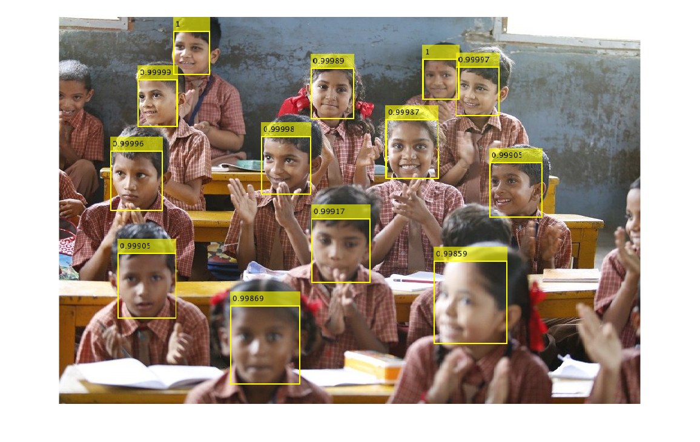

# Smart Attendance System
## For Smart India Hackathon 2020 - Hardware Edition
---
## About
This is project is being done as a part of the Hardware Edition of [Smart India Hackathon 2020](https://www.sih.gov.in). I am one of the team member of the team " Synapse " . The other team members are T.Purnima ( Team Leader) , Dinesh ,Divyagna , Rachana and G.Sathya . The problem statement was given by Govt. of Sikkim under the technology bucket of Smart Education .

## Problem Statement
- __Classroom Attendance Display__  
Design a small display board for displaying the number of students present during the first period. The class teacher locks the number and later others teachers can check the display for verification. Design a hardware based solution using CCTV camers that captures entry and exit of students in a class room. Additionally it should have ability to count the number of students in the class periodically.
---
## Dependencies
- __MATLAB with deep learning toolbox and hardware support package for RPi__
- __Raspberry Pi 3 & camera module__
- __Arm Compute Library on RPi__
---
## Face detection algorithm - MTCNN in action
 
 The added advantange of MTCNN over some of the othe traditional face detection algorithm is that it can detect side view faces as well and not only frontal faces .
 
 ---
 
 ## Usage on your local machine
 Its fairly simply .Just run the [mtcnnLiveVideo.m](https://github.com/baleshwar2508/smart-classroom-attendance/blob/master/mtcnnLiveVideo.m) in your MATLAB .Please ensure that MATLAB Support Package for USB Webcams is installed .
 
 The real challenge here is to deploy the face detection and recognition algorithms on the raspberry pi using arm compute library with opencv in the backend.
 
 ---
## For Deploying at the Central University of Karnataka , Kalaburagi   
[https://www.cuk.ac.in/](https://www.cuk.ac.in/)   
 - __Design Constraints__ -
 Using Open Souce softwares and tools

